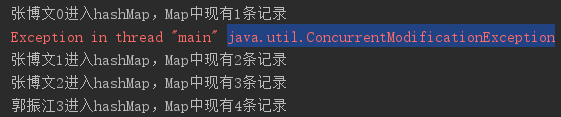
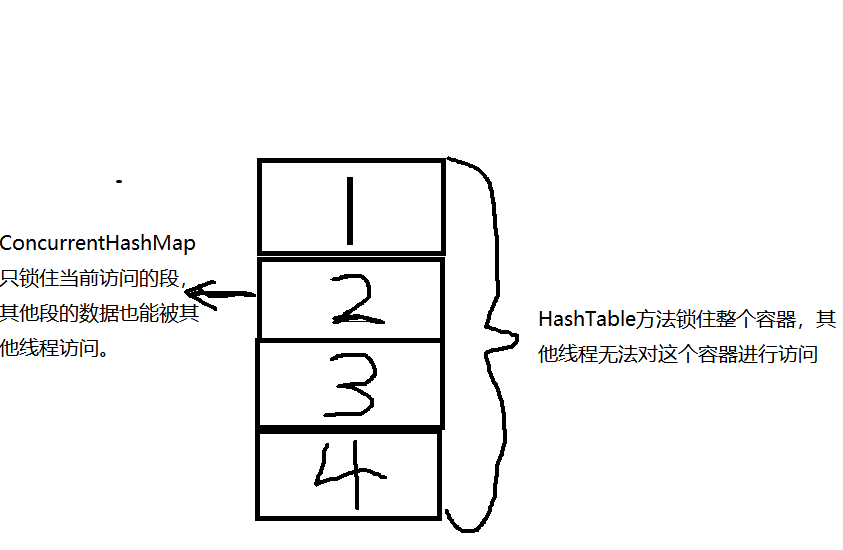
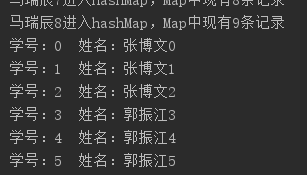

## 1. 作用介绍

#### 1.1 HashMap和Hashtable

HashMap性能好，速度快，可以使用null作为key或者value，**但不能保证线程安全。**

HashTable的公有方法均使用synchronize关键字修饰，能够保证线程安全，但这必然导致多线程时性能不佳。

为了在尽量保持性能的前提下实现了多线程安全，jdk1.5中引入了ConcurrentHashMap。



​				   **多线程使用HashMap报错 java.util.ConcurrentModificationException 并行修改异常**

#### 1.2 锁分段技术

HashTable容器在竞争激烈的并发环境下表现出效率低下的原因，是因为所有访问HashTable的线程都必须竞争同一把锁。那假如在容器中使用多把锁，每一把锁用于锁容器中的一部分数据，那么当多线程访问容器里不同数据段的数据时，线程间就不会存在锁竞争，从而可以有效的提高并发访问效率，这就是锁分段技术。



## 2.实例讲解

ConcurrentHashMap与HashMap都继承自AbstractMap类，它们可以被调用的方法也大致相同。

```java
public class ConcurrHashDemo {
    public static Map<String,String> map=new ConcurrentHashMap<>(16);
    public static void main(String[] args) {
        for (int i = 0; i < 3; i++) {
            StuRunnable stuRunnable=new StuRunnable(i+"", "张博文" +i);
            Thread t=new Thread(stuRunnable);
            t.start();
        }
        for (int i = 3; i < 6; i++) {
            StuRunnable stuRunnable=new StuRunnable(i+"", "郭振江" +i);
            Thread t=new Thread(stuRunnable);
            t.start();
        }
        for (int i = 6; i < 9; i++) {
            StuRunnable stuRunnable=new StuRunnable(i+"", "马瑞辰" +i);
            Thread t=new Thread(stuRunnable);
            t.start();
        }
        StuRunnable.printMap();
    }
}
```

上面的实例创建了九个线程操作同一个ConcurrentHashMap，令九个线程并行对此数据结构进行put操作，最后打印ConcurrentHashMap查看结果。

```java
public class StuRunnable implements Runnable{
    private String sno;
    private String sname;
    StuRunnable(){}
    
    public StuRunnable(String sno, String sname) {
        this.sno = sno;
        this.sname = sname;
    }

    @Override
    public void run() {
        Map<String,String> map=ConcurrHashDemo.map;
        map.put(sno,sname);
        System.out.println(sname+"进入hashMap，Map中现有"+map.size()+"条记录");
    }
    public static void printMap(){
        Map<String,String> map=ConcurrHashDemo.map;
        Set<Map.Entry<String,String>> entrySet=map.entrySet();
        for (Map.Entry<String,String> entry:entrySet) {
            System.out.println("学号："+entry.getKey()+"  "+"姓名："+entry.getValue());
        }
    }
}
```

在run方法中直接使用put操作ConcurrentHashMap，并打印出此条记录，可以看到在并行对Map进行“写”操作的过程并没有抛出异常，且Map打印结果符合期望。

PS：“读”操作是线程安全的，而“写”操作不是线程安全的，必须进行时序处理。简言之，对同一部分数据，可以同时读，但不能同时写。

代码运行结果：



显然“写”操作在ConcurrentHashMap中并没有引起线程混乱，那么此数据结构是如何保证线程安全的呢？分段锁技术又是怎样应用的？下面我们对ConcurrentHashMap源码进行分析。

## 3.源码分析

想要分析conCurrentHashMap的源码，必须先对hash表有一定的了解。

#### 3.1 Hash表

##### 3.1.1 基本概念

[散列表](https://baike.baidu.com/item/散列表/10027933)（Hash table，也叫哈希表），是根据关键码值(Key value)而直接进行访问的[数据结构](https://baike.baidu.com/item/数据结构/1450)。也就是说，它通过把关键码值映射到表中一个位置来访问记录，以加快查找的速度。这个映射函数叫做[散列函数](https://baike.baidu.com/item/散列函数/2366288)，存放记录的[数组](https://baike.baidu.com/item/数组/3794097)叫做[散列表](https://baike.baidu.com/item/散列表/10027933)。

**简言之，Hash表是一种使用存储空间来换取查询效率的数据结构**

##### 3.1.2 散列函数

在数据结构课程中，我们曾经学习过一种散列函数：（Node对象的hash属性值）%表长度，但在实际操作中，求余操作的速度是比较慢的。所以在Java语言中，底层采用（Node对象的hash属性值）&（表长度-1）作为映射函数，与运算要明显快于求余运算。

由于与运算的特殊性，采取此映射函数的Hash表长度必须为2的整数次幂，假设传递的initialCapacity的值是27，那么实际上表的长度是32。

##### 3.1.3 负载因子

默认的负载因子为0.75，我们假设表的长度为100，那么我们最多存储75个结点就要扩容（注意并不是占用75个槽以后才会扩容）。**负载因子是对查询效率和存储空间平衡关系的表示。**

下面我们以HashMap中主要导致线程不安全的put方法为例进行源码分析，从而了解ConcurrentHashMap为何是线程安全的。

#### 3.2 put方法分析

##### 3.2.1 put源码分析

找到源码中put方法，发现此方法调用了putVal方法。

```java
public V put(K key, V value) {
	return putVal(key, value, false);
}
```

putVal方法比较复杂，我们将对这段代码进行详细讲解

```java
final V putVal(K key, V value, boolean onlyIfAbsent) {
    if (key == null || value == null) throw new NullPointerException();//键或值为空时抛出空指针异常
    int hash = spread(key.hashCode());//求出Key的Hash属性值
    int binCount = 0;
    for (Node<K,V>[] tab = table;;) {//死循环执行，表的本质是结点数组
        Node<K,V> f; int n, i, fh;
        if (tab == null || (n = tab.length) == 0)//如果表为空，初始化表
            tab = initTable();
        else if ((f = tabAt(tab, i = (n - 1) & hash)) == null) {//如果映射函数映射的槽内无结点
            if (casTabAt(tab, i, null,
                         new Node<K,V>(hash, key, value, null)))//使用CAS乐观锁
                break;                   // no lock when adding to empty bin
        }
        else if ((fh = f.hash) == MOVED)//MOVED值为-1，表示Hash表正在扩容
            tab = helpTransfer(tab, f);//该线程去帮助它扩容
        else {
            V oldVal = null;
            synchronized (f) {//锁住头结点，保证线程安全（悲观锁）
                if (tabAt(tab, i) == f) {//保证头结点没有发生变化
                    if (fh >= 0) {//链表结构fh>=0,红黑树结构fh==-2
                        binCount = 1;//链表初始结点数为1
                        for (Node<K,V> e = f;; ++binCount) {
                            K ek;
                            if (e.hash == hash &&
                                ((ek = e.key) == key ||
                                 (ek != null && key.equals(ek)))) {//如果key相同
                                oldVal = e.val;//记录原来的value值
                                if (!onlyIfAbsent)
                                    e.val = value;//替换value值
                                break;
                            }
                            Node<K,V> pred = e;
                            if ((e = e.next) == null) {//在链表尾部插入新结点
                                pred.next = new Node<K,V>(hash, key,
                                                          value, null);
                                break;
                            }
                        }
                    }
                    else if (f instanceof TreeBin) {
    //红黑树结构，与链表结构功能相同，优化了查询效率，对红黑树实现机制不做过多阐述，有兴趣的读者可自行了解
                        Node<K,V> p;
                        binCount = 2;
                        if ((p = ((TreeBin<K,V>)f).putTreeVal(hash, key,
                                                              value)) != null) {
                            oldVal = p.val;
                            if (!onlyIfAbsent)
                                p.val = value;
                        }
                    }
                }
            }
            if (binCount != 0) {
                if (binCount >= TREEIFY_THRESHOLD)//如果结点数大于阈值（默认阈值为8）
                    treeifyBin(tab, i);//将此处链表组织为红黑树
                if (oldVal != null)//如果进行了替换操作，返回旧的value值
                    return oldVal;
                break;
            }
        }
    }
    addCount(1L, binCount);//查询Hash表是否需要扩容，若需要则扩容，若正在扩容则帮助扩容
    return null;
}
```


在上面的代码中编者尽可能的加入了注释来方便初学者理解。下面给出我对悲观锁和乐观锁的理解并阐述为什么在put源码中要这样使用。

##### 3.2.2 乐观锁与悲观锁

悲观锁：如synchronized，锁住之后不允许其他线程抢占（认为程序中的并发情况严重，所以严防死守）

乐观锁：如CAS，每次**不加锁**而是假设没有冲突而去完成某项操作（认为程序中的并发情况不那么严重，所以让线程不断去尝试更新）

CAS是英文单词Compare And Swap的缩写，翻译过来就是比较并替换。CAS机制当中使用了3个基本操作数：内存地址V，旧的预期值A，要修改的新值B。更新一个变量的时候，只有当变量的预期值A和内存地址V当中的实际值相同时，才会将内存地址V对应的值修改为B。

以上述源码为例，当判断映射函数映射的槽内无结点时，则应在这个位置插入新结点。此时乐观的认为在这两个操作之间的时间段没有其他线程对这个槽进行修改，不过在插入之前需再次判断槽内是否无结点（值为null），再次判断操作和插入操作被CAS封装成**原子操作。**

##### 3.2.3 原子操作

所谓原子操作是指不会被[线程调度](https://baike.baidu.com/item/线程调度/10226112)机制打断的操作；这种操作一旦开始，就一直运行到结束。Java内存模型中的可见性，原子性和有序性将在下一个文档**volatile**介绍中详细解释。在多线程中操作线程公共数据时必须保证原子性，仍旧以上面源码中的乐观锁为例。

如果不使用CAS机制再次判断，在第一次判断和修改之间由于没有锁，判断过后这个槽可能会被其他线程抢先修改，但这个线程不知晓此修改，就会覆盖掉其他线程抢先修改的内容，这就是非原子操作造成的线程不安全。

#### 3.3 源码分析总结

在本文档中以put方法为例介绍了ConcurrentHashMap如何保证线程安全以及如何使用分段锁技术在保证线程安全的前提下尽可能提高效率。ConcurrentHashMap类中各个方法都写的很好，建议大家阅读，增加对多线程编程的理解。