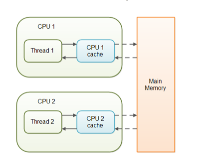

## 1.概念解释

首先介绍一下Java并发编程的三条重要性质：**原子性，有序性，可见性**。

#### 1.1 原子性

原子性指一个操作是**不可中断的**，操作一旦开始，就不会被其他线程干扰。在Java多线程编程中，通常采用synchronized和lock，unlock等保证操作的原子性。

判断以下操作哪些是原子操作：

```java
int a = 10; //1
a++; //2
int b=a; //3
a = a+1; //4
```

上面这四个语句中只**有第1个语句是原子操作**，将10赋值给线程工作内存的变量a,而语句2（a++），实际上包含了三个操作：1. 读取变量a的值；2：对a进行加一的操作；3.将计算后的值再赋值给变量a；所以a++并不是原子操作，语句3,4同理。

那么为何要保证操作的原子性呢？试想对于a++操作，CPU完成了对a进行加一的操作，正准备赋值给a时，突然有一个线程抢占了CPU，并修改了a的值。而此时a++所在的线程并不知晓这一点，仍然执行将计算后的值赋值给变量a，此时另一个线程修改的值就被覆盖掉，从而引发线程不安全。

#### 1.2 有序性

##### 1.2.1 JVM的重排序机制

实际上，当我们把代码写好之后，虚拟机不一定会按照我们写的代码的顺序来执行。例如对于下面的两句代码：

```java
int a = 1;
int b = 2;
```

对于这两句代码，你会发现无论是先执行a = 1还是执行b = 2，都不会对a,b最终的值造成影响。所以虚拟机在编译的时候，是有可能把他们进行**重排序**的。

你想啊，假如执行 int a = 1这句代码需要100ms的时间，但执行int b = 2这句代码需要1ms的时间，并且先执行哪句代码并不会对a,b最终的值造成影响。那当然是先执行int b = 2这句代码了。所以，虚拟机在进行代码编译优化的时候，对于**那些改变顺序之后不会对最终变量的值造成影响的代码**，是有可能将他们进行重排序的。

重排序是Java虚拟机中的一种优化策略，而这种策略在多线程情况下可能会出现问题，例如下面的代码：

```java
public class NoVisibility {
    private static boolean ready;
    private static int number;
    private static class ReaderThread extends Thread {
        @Override
        public void run() {
            while(!ready) {
                Thread.yield();
            }
            System.out.println(number);
        }
    }
    public static void main(String[] args) {
        new ReaderThread().start();
        number = 42;
        ready = true;
    }
}
```

我们预期run方法中打印出的number值为42，但实际上在main方法中是有可能对两个赋值语句进行重排序的。如果Java虚拟机这样做了，另一个线程就会受到影响，打印的number值就可能为0（默认值），引发线程不安全。

##### 1.2.2 volatile保证有序性

为了保证多线程编程的有序性，Java中提供了volatile修饰符，它能够禁止指令进行重排序优化。

如果一个变量被声明volatile的话，那么这个变量不会被进行重排序，也就是说，虚拟机会保证这个变量之前的代码一定会比它先执行，而之后的代码一定会比它慢执行。
例如把上面代码中的number声明为volatile，那么  number = 42  一定会比  ready = true  先执行。

#### 1.3 可见性

可见性是指当一个线程操作了共享变量后，其他线程能够立即得知这个操作。即线程对共享变量的操作相互之间是可见的。

是不是感觉很奇怪？共享变量在一个线程中修改，其他线程肯定是可见的呀，那么什么时候会不可见呢？为什么会不可见呢？这还要从CPU和主存的关系讲起。

众所周知，计算机CPU执行速度远快于IO速度（详见计算机组成原理），为了优化这种速度上的不平衡，人们设计了Cache缓存机制。将一些**频繁使用的数据**缓存到Cache块中，需要使用时就从Cache块中读取。Cache块容量小，造价高昂，但存取速度远快于主存。通过这种优化策略极大地提高了IO速度，但在多线程中，这种策略有时候会出现问题，如下图所示：



如果我们的处理器为多核的，那么每一个CPU都会拥有自己的cache块。当两个线程被分配给不同CPU执行时，若i为共享变量且频繁被使用，第一个线程对它进行修改后存入了自己的cache块，此时这个修改对第二个线程就不可见了，从而会引发线程不安全。

volatile修饰符能够保证它修饰的变量具有可见性。如果一个变量被volatile修饰，则JVM会阻止此变量进入cache寄存器，使用该变量时从主存中读取（放弃cache优化策略），从而保证了可见性。

## 2. volatile作用

通过上述的概念解释，我们已经基本明白了volatile的作用：
1.保证可见性，通过跳过cache直接使用主内存来实现。

2.保证有序性，通过禁止指令重排序优化来实现。

**简言之，为了提高运行速度，在代码底层存在某些优化策略，而这些优化策略在多线程环境下有时会出现问题。volatile修饰符会部分禁用这些优化策略来保证线程安全，这就是volatile的作用。**

PS：volatile并不能保证原子性，需要synchronized和lock，unlock等操作来保证。

## 3. volatile实例分析

下面我们以ConcurrentHashMap中的size方法为例来观察volatile修饰符如何协助实现线程安全的。

#### 3.1 size方法源码

首先发现在size方法中调用了sumCount方法计算结点的个数，返回时进行边界判断。

```java
public int size() {
    long n = sumCount();
    return ((n < 0L) ? 0 :
            (n > (long)Integer.MAX_VALUE) ? Integer.MAX_VALUE :
            (int)n);
}
```

ctrl+鼠标点击查看sumCount方法

#### 3.2 sumCount方法

```java
final long sumCount() {
    CounterCell[] as = counterCells; CounterCell a;//准备遍历的Hash表数组与迭代变量，已赋值
    long sum = baseCount; //初始结点数，默认为0
    if (as != null) {
        for (int i = 0; i < as.length; ++i) {
            if ((a = as[i]) != null)//如果该位置的槽中有结点
                sum += a.value;     //将此槽内结点个数累加到sum变量中
        }
    }
    return sum;
}
```

我在源码中加入了注释，算法非常容易理解，遍历Hash表将储存在头结点的结点数累加即可。

那么这个方法是如何保证线程安全的呢？

进入counterCells 数组定义，发现此变量使用了volatile修饰。假设其他线程删除了Hash表中某个头结点，此线程能够及时知晓，不会再统计此槽内结点个数，保证此处线程安全。

进入CounterCell类，发现类的value属性使用了volatile修饰。假设Hash表内某个红黑树或链表增加了一个结点，value属性的更改能够及时传达给size方法所在的线程，使得size方法统计的结点个数准确，保证此处线程安全。

最终ConcurrentHashMap的源码使用volatile实现了多线程下的size方法。

#### 3.3 总结

**综上所述，ConcurrentHashMap实现多线程安全是volatile，synchronized，CAS乐观锁等机制综合运用的结果，在保证线程安全的前提下尽可能提高了运行效率。**

**在多线程编程时需同时满足共享变量的原子性，有序性和可见性，否则就不能保证线程安全。**